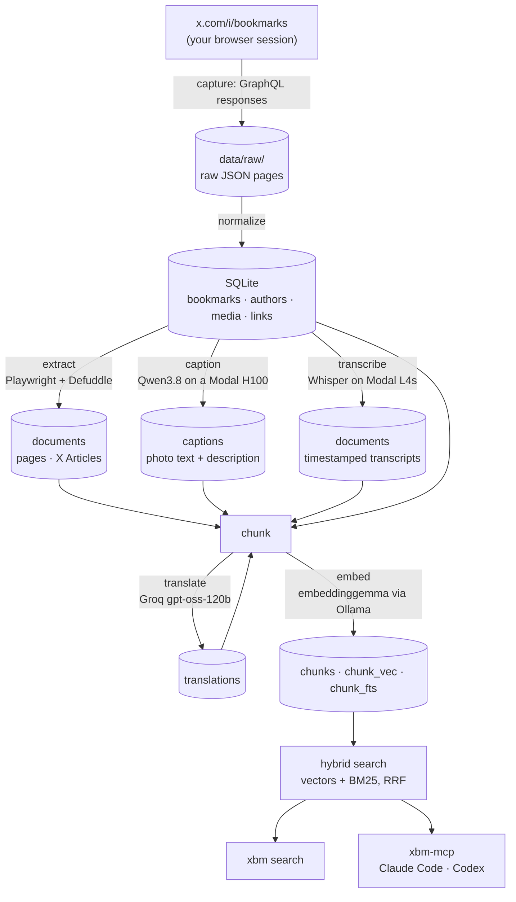

# x-bookmarks-rag

Search your X (Twitter) bookmarks in natural language, from the terminal or
from any coding agent over MCP.

A bookmark is rarely just its post. It is the article it links to, the
screenshot of a config, the hour-long podcast clip, the thread in Japanese.
This tool captures all of it and makes it searchable:

- **Posts and quoted posts**, captured from your own logged-in browser.
- **Linked pages and X Articles**, rendered in a real browser and reduced to
  readable text.
- **Photos**, captioned and OCR'd by a vision model, so text inside a
  screenshot is searchable.
- **Videos**, transcribed with timestamps, so a passage at 1:58:09 of a
  podcast is one query away.
- **Foreign text**, translated into English and indexed with its original.

Search is hybrid: dense vectors and BM25, fused with reciprocal rank fusion.
Each result is the passage that matched, not just the post.

No X API. Embedding and search run on your machine.

## Pipeline



Data flows one way. Each stage reads only what the stage before it wrote, and
handles only what is new. Raw pages stay on disk, so the database can always
be rebuilt with `xbm normalize` without touching X again.

| Stage | Runs on | Cost |
| --- | --- | --- |
| capture, normalize, extract | your machine | free |
| caption | Modal, one H100 | about $1 for 600 photos |
| transcribe | Modal, up to 8 L4s | under $1 for 51 hours of video |
| translate | Groq | free tier |
| embed, index, search | your machine (Ollama) | free |

## Requirements

- [uv](https://docs.astral.sh/uv/)
- [Ollama](https://ollama.com) with `embeddinggemma` pulled
- A [Modal](https://modal.com) account, for captions and transcripts
- A [Groq](https://console.groq.com/keys) API key, for translation

Each remote service is optional. Leave out what you do not want (see
[Choosing what to index](#choosing-what-to-index)).

## Install

```sh
git clone https://github.com/sudoanmol/x-bookmarks-rag
cd x-bookmarks-rag
uv sync
uv run playwright install chromium
ollama pull embeddinggemma
uv run modal setup        # captions and transcripts
cp .env.example .env      # then set GROQ_API_KEY, for translation
```

## Use

```sh
uv run xbm login          # opens a browser; sign in to X once
uv run xbm sync           # capture, enrich, and index what is new
uv run xbm search "the article about kv caching"
uv run xbm status         # coverage per stage, and what each stage needs
```

`xbm sync` runs every stage in order: capture, extract, caption, transcribe,
translate, index. If one stage fails, the others still run, so new posts
still reach the index, and the command exits non-zero.

Search options:

```sh
uv run xbm search "postgres connection pooling" -n 5
uv run xbm search "design systems" --author shadcn
uv run xbm search "the slide with the pricing table" --source image
uv run xbm search "what did he say about HBM" --source video
```

Each stage is also its own command, for reruns and repairs:

```sh
uv run xbm capture        # capture only
uv run xbm extract        # pages and X Articles   (--limit, --retry)
uv run xbm caption        # photos                 (--limit, --retry)
uv run xbm transcribe     # videos                 (--limit, --retry)
uv run xbm translate      # foreign chunks
uv run xbm index          # chunk and embed        (--rebuild)
uv run xbm normalize      # rebuild the database from raw pages
```

Two rules keep GPU spend down:

- **Photos wait for a batch.** The vision model takes 5 to 8 minutes to start,
  the same for 1 photo as for 600, so `xbm sync` captions only once 20 new
  photos are waiting. `xbm caption` captions whatever is waiting, right away.
- **Failures wait for you.** A failed photo or video is not retried on its
  own, because the usual failure is media deleted at X. Pass `--retry`.

## Choosing what to index

Posts are always indexed. Everything else can be left out, which also skips
the stage that produces it. Save your choice in
`~/.config/x-bookmarks/config.toml`:

```toml
exclude = ["video", "quote"]   # any of: article, link, image, video, quote
translate = true               # false indexes foreign text as written
```

`xbm sync` and `xbm index` both read it. Flags add to it for one run:

```sh
uv run xbm sync --no-images          # config, plus no photos this run
uv run xbm sync --no-videos --no-translate
uv run xbm index --no-links
```

| Flag | Leaves out |
| --- | --- |
| `--no-articles` | X Articles |
| `--no-links` | linked pages and link cards |
| `--no-images` | photo captions and OCR |
| `--no-videos` | video transcripts |
| `--no-quotes` | quoted posts |
| `--no-translate` | translation; foreign text is indexed as written |

Leaving something out removes it from the index but keeps it in the database.
Include it again and the next `xbm index` brings it back.

## Use it from a coding agent (MCP)

`xbm-mcp` is a stdio MCP server with three tools:

| Tool | Returns |
| --- | --- |
| `search_bookmarks(query, limit, author, source)` | One passage per bookmark, with `chunk_count` and `word_count` so the caller knows when there is more to read. |
| `get_bookmark(tweet_id)` | Full post, quoted post, author, links, and media with captions. Never document bodies. |
| `read_document(tweet_id_or_url, query, offset)` | The page or transcript behind a bookmark. With `query`, the best passages inside it. Without, bounded pages with `has_more`. |

Replace the path below with where you cloned the repository.

### Claude Code

```sh
claude mcp add --scope user x-bookmarks -- uv run --project ~/path/to/x-bookmarks-rag xbm-mcp
```

Check it with `claude mcp list`, or `/mcp` inside a session.

### Codex

```sh
codex mcp add x-bookmarks -- uv run --project ~/path/to/x-bookmarks-rag xbm-mcp
```

Check it with `codex mcp list`.

## How capture works

The X web app loads your bookmarks from an internal GraphQL endpoint. A real
browser runs your session, and this tool reads the network responses. That
gives full post text, media URLs, video variants, link cards, quoted posts,
and language codes as clean JSON.

- **Nothing is missed.** The timeline is virtualized, so a DOM scraper loses
  rows that scroll past. Cursor paging cannot skip a page.
- **Nothing is forged.** X signs each API call with a header built by
  obfuscated page JavaScript. The browser makes its own requests.

**Incremental sync.** X orders bookmarks by when you bookmarked them. After a
clean run the highest position is saved as a watermark, and the next run stops
one page past it. A crash leaves the watermark alone, and raw pages are
already on disk, so nothing is lost. `xbm sync --full` walks everything and
marks posts you un-bookmarked as removed. That is a soft delete: their
captions and transcripts stay.

**Session.** `xbm login` saves a Playwright storage state to
`~/.config/x-bookmarks/state.json` with mode `0600`, outside the repository.
Only X pages use it. Every external page opens in a browser context with no
storage state, so a third-party site never sees your login. When the session
expires, capture stops with an error instead of reporting zero bookmarks.

## Development

```sh
uv run pytest -q          # offline, about one second
```

Tests use synthetic GraphQL fixtures and stub every network call: Modal, Groq,
and Ollama. `AGENTS.md` holds the design decisions, the measurements behind
them, and the lessons that cost real time.

## Terms of service

X forbids automated collection. This reads your own bookmarks, from your own
session, on your own machine, and paces itself between scrolls. The account
risk is real and yours to weigh.
